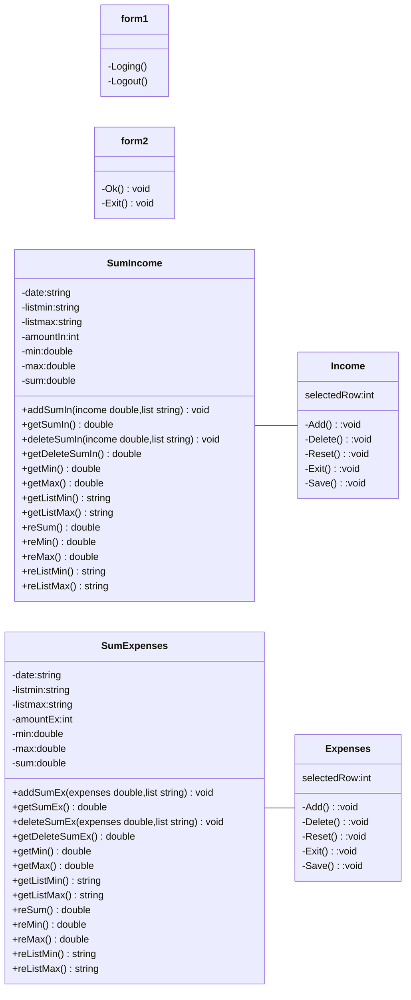

# Final-Project
ความเป็นมาของโปรแกรม
```
โปรแกรมบันทึกรายรับรายจ่ายของของตนเอง เป็นโปรแกรมที่สร้างขึ้นมาก็เพื่อแก้ปัญหาการใช้จ่ายเงินและต้องการที่จะทราบว่าเราใช้จ่ายอะไรบ้าง
และใช้เงินเป็นจำนวนเท่าไหร่ และต้องการทราบว่ารายรับเรามีเท่าไหร่
```
วัตถุประสงค์ของโปรแกรม
```
1.เพื่อช่วยในการบันทึกรายรับและรายจ่ายของตนเอง แสดงรายรับรายจ่ายรวม แสดงรายการรายรับสูงสุดและต่ำสุด แสดงรายการรายจ่ายสูงสุด
และต่ำสุด
2.เพื่อที่จะสามารถทราบว่าเราได้ใช้เงินไปกับอะไรบ้าง
```

Class Diagram

ผู้พัฒนาโปรแกรม
```
นางสาวนภาปิลันธ์ ชาวชายโขง รหัสนักศึกษา 643450327-0
```
