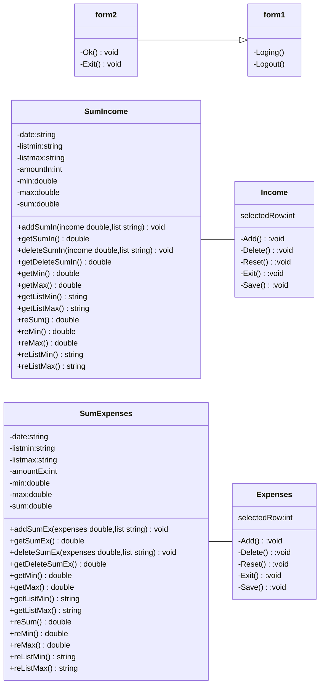

# Final-Project
ความเป็นมาของโปรแกรม
```

```
วัตถุประสงค์ของโปรแกรม
```

```

Class Diagram

```mermaid
classDiagram
  direction LR
  class form1{
  -Loging()
  -Logout()
  }
  class form2{
  -Ok()void
  -Exit()void
  }
  class Income{
  selectedRow:int 
  -Add():void
  -Delete():void
  -Reset():void
  -Exit():void
  -Save():void
  }
  class Expenses{
   selectedRow:int 
  -Add():void
  -Delete():void
  -Reset():void
  -Exit():void
  -Save():void
  }
  class SumIncome{
  -date:string
  -listmin:string
  -listmax:string
  -amountIn:int
  -min:double
  -max:double
  -sum:double
  +addSumIn(income double,list string)void
  +getSumIn()double
  +deleteSumIn(income double,list string)void
  +getDeleteSumIn()double
  +getMin()double
  +getMax()double
  +getListMin()string
  +getListMax()string
  +reSum()double
  +reMin()double
  +reMax()double
  +reListMin()string
  +reListMax()string
  }
  class SumExpenses{
  -date:string
  -listmin:string
  -listmax:string
  -amountEx:int
  -min:double
  -max:double
  -sum:double
  +addSumEx(expenses double,list string)void
  +getSumEx()double
  +deleteSumEx(expenses double,list string)void
  +getDeleteSumEx()double
  +getMin()double
  +getMax()double
  +getListMin()string
  +getListMax()string
  +reSum()double
  +reMin()double
  +reMax()double
  +reListMin()string
  +reListMax()string
  }
  form2 --|> form1
  SumExpenses -- Expenses
  SumIncome -- Income
```
ผู้พัฒนาโปรแกรม
```
นางสาวนภาปิลันธ์ ชาวชายโขง รหัสนักศึกษา 643450327-0
```
